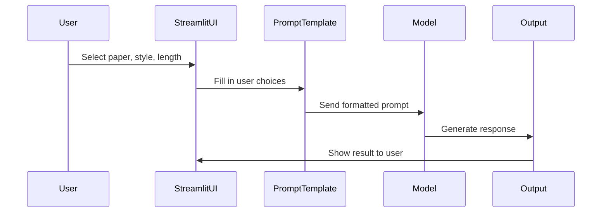

# LangChain Learning Project

Welcome to this LangChain learning project! This repo has simple, practical examples to help you learn how LangChain works.


## 📁 What's in this project?

The project is organized into 5 main folders:

### 1. **1.models/** - How to use different AI models
- **LLMs/** - Examples using regular language models
- **chatModels/** - Examples using chat-style models (OpenAI, Google, Anthropic, Hugging Face)
- **embeddings/** - Examples for converting text into embeddings (for similarity searches)

### 2. **2.prompts/** - How to create good prompts
- `prompts_ui.py` - A Streamlit app that lets you summarize research papers with custom styles!
- Other prompt template examples

### 3. **3.structure_output/** - Get structured responses
- Examples for getting JSON or Pydantic object outputs from models

### 4. **4.output-parser/** - Parse model outputs
- Examples for parsing text, JSON, and structured outputs

### 5. **5.chains/** - Chain multiple steps together
- Simple chains, sequential chains, parallel chains, and conditional chains


## 🚀 How to run this project

### Step 1: Install dependencies
First, install all the required packages:
```bash
pip install -r requirements.txt
```

### Step 2: Set up environment variables
Create a `.env` file in the root folder and add your API keys:
```
OPENAI_API_KEY=your-openai-key
GOOGLE_API_KEY=your-google-key
ANTHROPIC_API_KEY=your-anthropic-key
HUGGINGFACEHUB_ACCESS_TOKEN=your-huggingface-token
```

### Step 3: Run the examples
- To see the LangChain version: `python main.py`
- To run the research paper summarizer UI: `streamlit run 2.prompts/prompts_ui.py`
- You can also run any other `.py` file directly to see that example!


## 🔄 How it works (Sequence Diagram)

Here's a simple flow of how the code works (using the research paper summarizer as an example):



### Step-by-step flow:
1. **User** interacts with the UI and selects options
2. **Prompt Template** takes the user's choices and creates a nice prompt
3. **Model** (like Gemini or GPT) processes the prompt
4. **Output** is sent back and displayed to the user


## 💡 Tips
- Start with the `1.models/` folder to learn the basics
- Then try `2.prompts/` to see how prompts work
- Finally check `5.chains/` to see how to chain multiple steps together!
